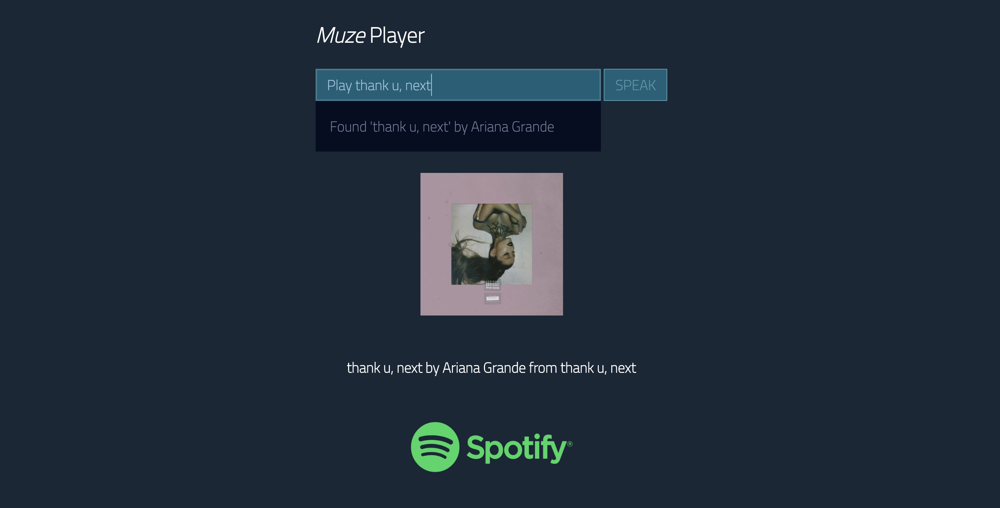

## Overview
The [Muze Player](http://muze-player.herokuapp.com/) is an app for discovering and listening to music. This is its source code repo.

> Play No One by Alicia Keys

> Play something like No One but more acoustic

> Play something like No One but less popular

> Play something like No One but sadder

The app integrates with:
* Spotify's [Web Playback SDK](https://developer.spotify.com/documentation/web-playback-sdk/) for streaming music and [Web API](https://developer.spotify.com/documentation/web-api/) for compiling music metadata
* [Dialogflow](https://dialogflow.com/) to create a natural language user interface

The app consists of:
* A minimal web client that:
    * streams music
    * accepts raw text and voice input from the user
    * communicates with the server via [web sockets](https://www.fullstackpython.com/websockets.html)
* A server app that:
    * communicates with client via web sockets
    * uses a Dialogflow agent to process raw natural language user input
    * contains a music knowledge API that exposes info about musical entities (songs, artists, genres, relationships therein) that is internally organized using a semantic network

## Setup
### Prerequisites
* [SQLite3](https://www.sqlite.org/download.html)
* [Python](https://www.python.org/downloads/) 3.5 or higher and [pip](https://pypi.org/project/pip/)
* [Spotify premium account](https://www.spotify.com/us/premium/?utm_source=ca-en_brand_contextual_text&utm_medium=paidsearch&utm_campaign=alwayson_ucanz_ca_premiumbusiness_premium_brand+contextual+text+exact+ca-en+google&gclid=CjwKCAjwhbHlBRAMEiwAoDA3450erN_3OgzZ-r-D7byldS_fHtBu9qB4ezr_pEoPDQsepMWP1Q_7NxoCWvEQAvD_BwE&gclsrc=aw.ds) for streaming music

### Dependencies
Whether or not you use a virtual environment:
```
pip install -r requirements.txt
```

## Music Knowledge API
The Music Knowledge Representation (MKR) API exposes a collection of functions that encapsulate all SQL queries and logic relating to managing the database; through the MKR API, callers may retrieve/add information from/to the database. A detailed description is available in [`design_docs/Music Knowledge Base Design Doc.pdf`](https://github.com/okjuan/muze/blob/master/design_docs/Music%20Knowledge%20Base%20Design%20Doc.pdf). This component was originally developed as part of a [distinct, collaborative project](https://github.com/MIR-Directed-Research/intelligent-music-recommender).

## Testing
### Running the App Locally
Temporarily set the `redirectUri` in [`player.js`](https://github.com/okjuan/muze/blob/master/app/static/player.js) to `"https://muze.serveo.net"` and the socket connect URL in [`index.js`](https://github.com/okjuan/muze/blob/master/app/static/index.js) to `"https://localhost:5000"`. Then, from the project root directory, run the `run-local` script:
```
$ bash app/run-local.sh
```

The script assumes that the environment variables `$MUZE_PROJECT_ID` and `$MUZE_PATH_TO_CREDS` are set to the corresponding Dialogflow agent project ID and Google Cloud Platform API Key JSON (see [setup guide](https://dialogflow.com/docs/reference/v2-auth-setup)). [Serveo](https://serveo.net/) is used to make the local Muze service **publicly available** so that it can communicate with the Dialogflow agent.

*NOTE*: A Spotify premium account is necessary to stream music.

Try any of the following examples to play a song:

> Play No One by Alicia Keys

> Play something like No One but more acoustic

> Play a song like No One but less popular

> Play a song like No One but sadder

### Unit Tests
Run the tests from the project's root folder:
```
$ python run_tests.py
...
----------------------------------------------------------------------
Ran 56 tests in 0.943s

OK
```
